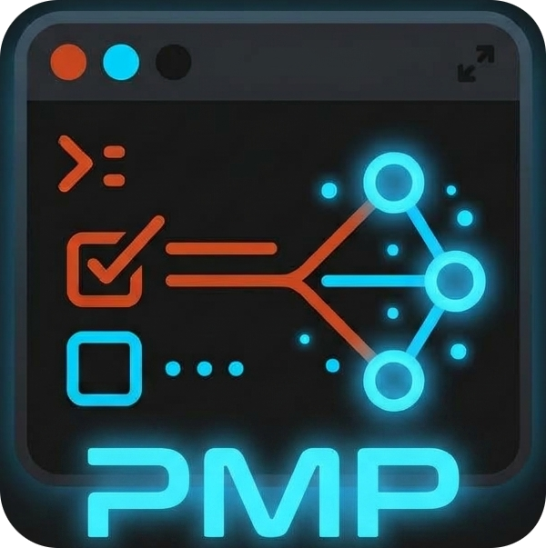

<div align="center">
  
  <h1>🚀 PMP (Project Management Program)</h1>
  <p><strong>Manage your projects and tasks from the terminal with style and efficiency.</strong></p>

  [](LICENSE)
  [](https://www.rust-lang.org/)
</div>

---

## 🌟 What is PMP?

**PMP** is a powerful project management tool designed for developers and terminal lovers. Gone are the days of context-switching between your code editor, the terminal, and a heavy web app to manage your tasks.

With PMP, you get a local, blazing-fast, keyboard-driven project manager powered by a built-in **MCP (Model Context Protocol) Server**.

### What is it for?

- 🗂️ **Organize Projects**: Create, edit, and keep track of all your projects in one place.
- ✅ **Task Management**: Create tasks, assign priorities, statuses (Todo, InProgress, Done), and dependencies between them.
- 🔗 **AI Integration**: Run the built-in MCP server to allow AI assistants to read and update your development status automatically.

---

## ✨ Key Features

- 🖥️ **Elegant TUI (Terminal User Interface)**: Built with `ratatui` for a premium visual experience in your console.
- ⚡ **Fast and Lightweight**: Written in Rust, it consumes minimal resources and responds instantly.
- 🧠 **Built-in MCP Server**: With a simple `pmp mcp` command, the app exposes your projects and tasks via the *Model Context Protocol*, making integration with AI and other modern tools seamless.
- 🔒 **Total Privacy**: All your data is stored locally using SQLite. Your data is yours alone!
- 🔗 **Task Dependencies**: Prevents moving tasks to "Done" if their dependencies haven't been resolved yet.

---

## 🚀 Installation

Install the `pmp` binary with Cargo. You need:

- **Rust 1.85 or newer**, because the project uses edition 2024. [rustup](https://rustup.rs/) is the usual way to get it.
- A **C compiler**, because `rusqlite` builds embedded SQLite: `build-essential` on Linux, Xcode Command Line Tools on macOS, and Visual Studio Build Tools on Windows.

`cargo install --git` uses your active toolchain and does **not** apply `rust-toolchain.toml`. The **1.98.1** pin is for contributors and CI.

### Install with Cargo

```bash
cargo install --git https://github.com/dtorrensf/pmp
```

That installs the `pmp` binary in `~/.cargo/bin`. If you installed Rust with rustup, that directory must be on your `PATH`.

There are no tags yet.

### Build from a clone (contributors)

```bash
git clone https://github.com/dtorrensf/pmp.git
cd pmp
cargo build --release
```

The binary is `target/release/pmp`.

---

## 🤖 AI agent integration

PMP includes a four-agent pipeline (`pmp-orchestrator`, `pmp-query`, `pmp-plan`, `pmp-implement`) that works with Claude, OpenCode, Cursor, Copilot, Codex, and Antigravity. The installer renders the agents and wires the built-in MCP server for each tool.

Install the agents into the current project with:

```bash
pmp agents install --target all --scope project
```

For per-target file paths, MCP wiring details, manual install commands, and global scope options, see [`docs/agents.md`](docs/agents.md).

---

## 💻 How to Use

Using PMP is as simple as typing a command.

### Terminal Interface (TUI)

To open the interactive interface, simply run:

```bash
pmp
```

Use the **arrow keys** to navigate, **Tab** to change statuses or jump between panels, and follow the on-screen keyboard shortcuts to manage your projects.

### MCP Server

If you want to integrate PMP with LLM-based assistants or other MCP-compatible applications, run:

```bash
pmp mcp
```

The server will start and interact smoothly with your environment.

---

## 🤝 Contributing

PMP is a 100% **Open Source** project! We love receiving pull requests, suggestions, and bug reports.

1. Fork the project.
2. Create your feature branch (`git checkout -b feature/NewFeature`).
3. Commit your changes (`git commit -m 'Add New Feature'`).
4. Push to the branch (`git push origin feature/NewFeature`).
5. Open a Pull Request.

---

## 📜 License

This project is licensed under the **AGPL-3.0-or-later** license. This means you are free to use, modify, and distribute the software, provided that any derivative works or modified network services maintain the same license and are open source.

See the [`LICENSE`](LICENSE) file for more details.

---
<div align="center">
  Made with ❤️ by the Open Source community.
</div>
